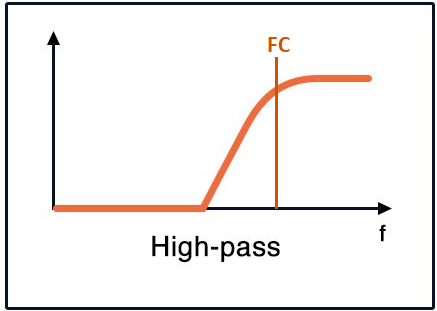
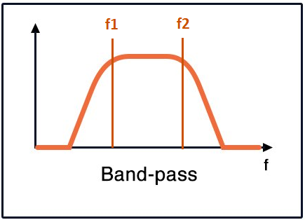

# Preprocessing

The following functions are applied to the raw data before executing the analysis. **Multiple** functions are allowed. In this case, the execution order is from top to bottom. **You can drag the elements to order them**.

**Savitzky–Golay filter -** The Savitzky smoothing filter is commonly used to "smooth out" a noisy signal with a large frequency span (without noise). It applies a smoothing filter to the input data with polynomial order "***Order***" and frame length "***Window***." In some applications, Savitzky-Golay filters outperform standard averaging FIR filters, which tend to filter high-frequency content alongside noise. Savitzky-Golay filters are better at preserving high frequency signal components but less effective at rejecting noise. [More information](https://en.wikipedia.org/wiki/Savitzky%E2%80%93Golay_filter)

**low-pass filter(LPF) -** A lowpass filter suppresses or attenuates the high frequency components of a spectrum while allowing the low frequencies smaller than the cut-off frequency (***FC***) to pass through. The ***Order*** of a filter determines the form of the differential equation governing the filter’s behaviour  [More information](https://en.wikipedia.org/wiki/Low-pass_filter) 

**high-pass filter(HPF) -** A highpass filter suppresses or attenuates the lower frequency components of a spectrum while allowing the high frequencies greater than the cut-off frequency (***FC***) to pass through. The ***Order*** of a filter determines the form of the differential equation governing the filter’s behaviour [More information](https://en.wikipedia.org/wiki/High-pass_filter)

**band-pass filter(BPF) -** A band pass filter suppresses or attenuates the frequencies lower than **f1** or greater than **f2**. The ***Order*** of a filter determines the form of the differential equation governing the filter’s behaviour [More information](https://en.wikipedia.org/wiki/Band-pass_filter)

**band-stop filter(BSP) -** A band pass filter suppresses or attenuates the frequencies greater than **f1** or lower than **f2**. The ***Order*** of a filter determines the form of the differential equation governing the filter’s behaviour [More information](https://en.wikipedia.org/wiki/Band-stop_filter)

**moving average -** The moving average smooths measured data by replacing a each point with the average of its neighbors considering the given "***Window***" length. The smoothness of the output increases as the filter length increases, while the sharp modulations in the data become increasingly blunt.  [More information](https://en.wikipedia.org/wiki/Moving_average)

**median filter -**  The moving average smooths measured data by replacing a each point with the median of its neighbors considering the given "***Window***" length. The smoothness of the output increases as the filter length increases, while the sharp modulations in the data become increasingly blunt. The output is similar to the moving average however the median filter generally is less sensitive to outliers, and could not remove the value if the spike is considerably large. [More information](https://en.wikipedia.org/wiki/Median_filter)