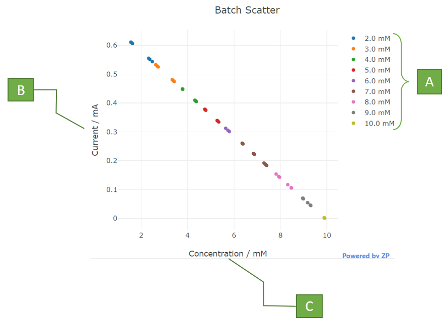
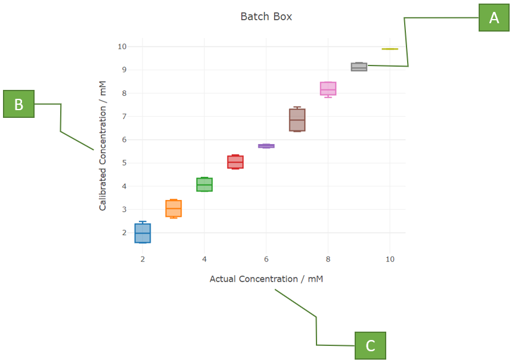

# Statistical Evaluation

If enabled, the report includes a group of cards with statistics about the calculated fit. It consists of four elements: Batch Scatter Graph, Batch Histogram Graph, Batch Box Graph and Statistics Table.

***Parameters:***

​		**Hist. BW:** Bar width of the Batch Histogram Graph

## Batch Scatter Graph

It is the scatter representation of the current vs calculated concentration for each given concentration.

A. **Concentration:** Actual concentrations provided by the user represented by different colors on the graph. The units can be changed in 'Properties -> General -> Units -> Units'

B. **Y-axis:** Magnitude of current, extracted from the input data. The units and range can be modified in 'Properties -> General -> Units -> Current (output)'

C. **X-axis:** Calculated concentration. The untis can be changed in 'Properties -> General -> Units -> Units'

## Batch Histogram Graph

It is the graphical representation of the histogram of the calibrated concentrations. The width of the bar can be changed with the parameter ***Hist. BW***

A. **Concentration:** Actual concentrations provided by the user represented by different colors on the graph. The units can be changed in 'Properties -> General -> Units -> Units'

B. **Y-axis:** Shows occurrence of the different calculated concentrations using the Fit.

C. **X-axis:** Actual concentration provided by the user. The untis can be changed in 'Properties -> General -> Units -> Units'

## Batch Box Graph

It is the representation in box graph (with max, min, mean, first quartile, third quartile) of the calibrated concentration vs the actual concentration.

A. **Box element:** Each concentration has a box which includes the max, min, mean, first quartile and third quartile.

B. **Y-axis:** Calibrated Concentrations. The units and range can be modified in 'Properties -> General -> Units -> Units'

C. **X-axis:** Actual Concentration. The units and range can be modified in 'Properties -> General -> Units -> Units'

## Statistics Table

Table including statistics of each concentration provided by the user. It calculates the **Mean**, Standard Deviation (**SD**), Relative Standard Deviation in percentage (**RSD %**), **Median**, Minimum (**Min**) and Maximum(**Max**) value