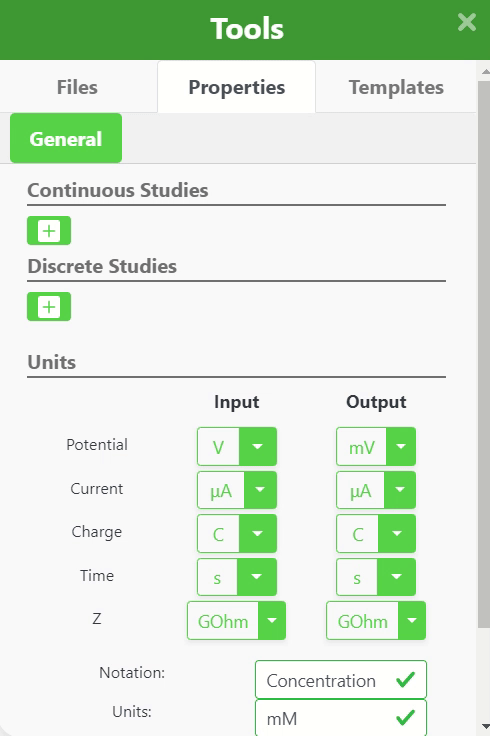

#### Continuous Studies

Continuous studies are time-dependent studies that include:

- Continuous Potentiometry
- Continuous Amperometry

Learn more in [ZP Academy](https://academy.zimmerpeacock.com/courses)