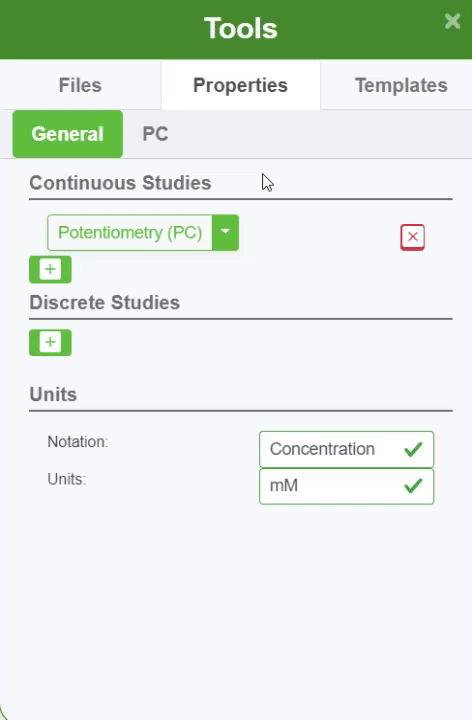

#### Discrete Studies

Discrete studies are time-dependent studies that include:

- Discrete voltammetry
- Discrete Amperometry
- Discrete Potentiometry
- Discrete Impedance
- Discrete Generic

Learn more in [ZP Academy](https://academy.zimmerpeacock.com/courses)