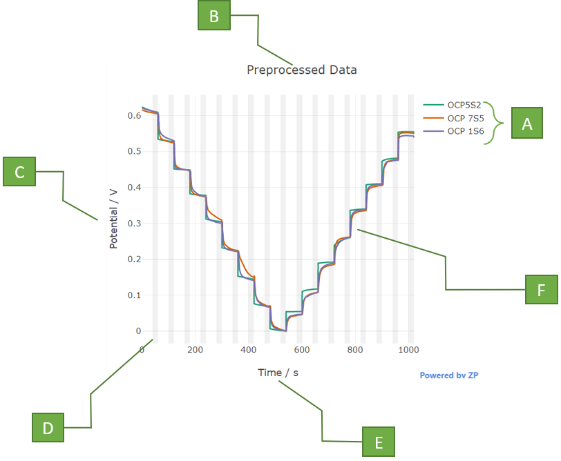

`Media,Examples`

# Raw Graph

It is the graphical representation of the Raw data. Modified by Jose.

A. **Concentration:** Concentrations acquired from the data files. Each color represents a different concentration in the plot.

B. **Y-axis:** Magnitude of current. The units and range can be modified in 'Plot Properties -> Units'

C.  **X-axis:** Value of t1 in the X-axis. *This variable is employed in the construction of the Delta Fit Plot. The width is defined by the variable 'mean'. The variable 't1' and 'mean' can be modified in the properties of the Delta Fit Plot.*

#### New section Jose

[https://www.youtube.com/watch?v=B6uVRVLYjJs]()
