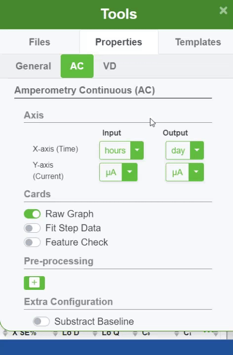

#### Y-axis (Current)

Y-axis represents the Current and can have inputs and outputs with these units :

- Amps
- Milli Amps
- Micro Amps
- Nano Amps
- Pico Amps

Learn more in [ZP Academy](https://academy.zimmerpeacock.com/courses)