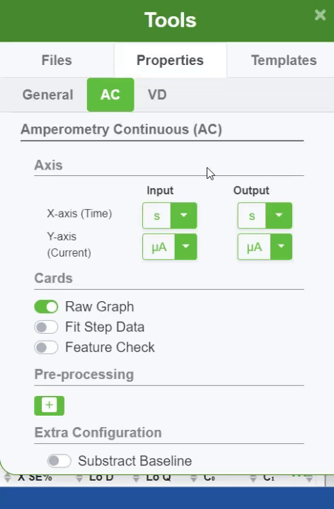

#### X-axis (Time)

X-axis which represents time can have inputs and outputs in these formats

- Seconds

- Minutes

- Hours

- Days

  

Learn more in [ZP Academy](https://academy.zimmerpeacock.com/courses)